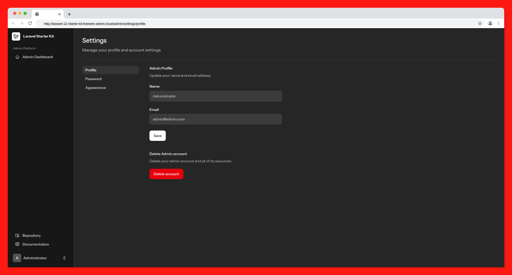

# Laravel 12 Admin Starter Kit Livewire

## Preview


## About This Repository

This is a repository created to show how to create an Admin Panel in Laravel 12 using the Livewire Starter Kit(without Volt), using an "Admin" Model and with all the authentication features available in the "User" Model.

Since the Breeze and Jetstream packages have been discontinued, this repository was created to show how to create the same functionality without them.

## Features
- Admin Authentication(login, register, password reset, password confirmation, email verification)
- Automatic Redirection to `admin.login` route if not authenticated(using Exception Handler)
- Automatic Redirection to `admin.index` route if authenticated
- Admin Views(clone of default views)

## Stack
- Laravel 12(with Livewire Starter Kit)
- Livewire 3(without Volt)
- Tailwind CSS
- Alpine.js

## Requirements
- PHP >= 8.2
- Composer
- Node.js
- NPM

## Installation
1. Clone the repository
```bash
git clone rubensrocha/Laravel-12-Admin-Starter-Kit-Livewire
```
2. Change directory to the cloned repository
```bash
cd Laravel-12-Admin-Starter-Kit-Livewire
```
3. Install the dependencies
```bash
composer install
```
4. Copy the `.env.example` file to `.env`
```bash
cp .env.example .env
```
5. Generate the application key
```bash
php artisan key:generate
```
6. Create the database and update the `.env` file with the database credentials
```bash
DB_CONNECTION=mysql
DB_HOST=127.0.0.1
DB_PORT=3306
DB_DATABASE=laravel
DB_USERNAME=root
DB_PASSWORD=
```
7. Run the migrations
```bash
php artisan migrate
```
8. Install the frontend dependencies
```bash
npm install
```
9. Build the frontend assets
```bash
npm run build
```
10. Start the development server
```bash
php artisan serve
```
11. Visit the application in your browser
```bash
http://localhost:8000
```

## Usage
- Visit the `/admin` route to access the admin panel
- You can change `/admin` prefix in the `bootstrap/app.php` file


## License

The Laravel framework, and this repository, is open-sourced software licensed under the [MIT license](https://opensource.org/licenses/MIT).
